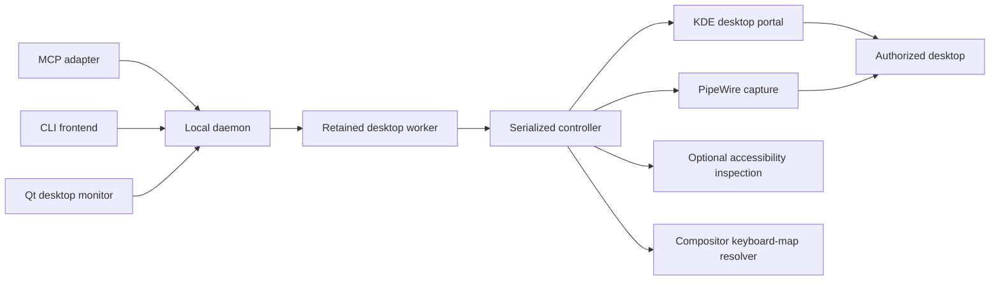

# Architecture

LCU is a local Rust executable with an image-aware Model Context Protocol frontend and a direct command-line frontend. An optional Qt 6 Widgets companion provides the native desktop monitor. All use one Unix-socket daemon and the Rust-owned typed request/reply contract. CLI operation never depends on MCP. Retained workers own desktops; the daemon routes each frontend's independent worker connections rather than owning a second mutable desktop registry.

## Current control path

Each worker owns its graphical session, services, applications and connection-owned claim. Its controller owns portal access, the claimant's latest observation, gesture validation and input cleanup. An ordered ledger records held inputs, including presses whose acknowledgements may have been interrupted. Cancellation cannot abandon those inputs silently.

KDE's desktop portal authorizes screen capture and input. PipeWire and GStreamer deliver image samples; observation geometry maps a returned crop or resize back to the selected stream. Capture sequence and age are evidence about received samples, not proof of application progress.

The KDE portal adapter normalizes the endpoint's reversed vertical scroll sign to LCU's positive-down contract; horizontal deltas are unchanged. Named keyboard chords use the running compositor's actual keymap and active layout to prepare physical events. Explicit physical codes remain available without named-key resolution. Accessibility is optional and application-reported; it provides bounded inspection and explicit focus checks without replacing visual targeting.

## Authority and persistence

| Concern | Owner |
|---|---|
| Tool and command structures | Rust types and generated MCP schema |
| Input ordering and cleanup | Input engine under the controller |
| Desktop services, applications and live claims | Per-desktop worker |
| Frontend connection routing and creation coordination | Daemon |
| Desktop/resource identity and boot/PID/start identities for cleanup | State-storage desktop descriptor |
| Latest claimant observation and action eligibility | Controller |
| Screen samples and capture diagnostics | Capture subsystem |
| Desktop authorization | User and desktop portal |
| Saved restore permission | Private user state store |
| Delivery scope and outcome state | Git history and releases |
| Raw incidents and observations | GitHub issues |

Screen images and typed text are not automatically logged by LCU. Clients may retain tool results according to their own settings. Saved permission belongs to the user's private state directory and may be revoked by the desktop.

## Owned-desktop boundary

Owned desktops use separate virtual KWin sessions, private foreground D-Bus services, private permission stores and application settings, and explicit routing to the host PipeWire server. The environment is constructed before worker exec, never changed globally inside a multithreaded process. Accessibility is optional. Main uses a distinct worker that owns control access, not the user's compositor or applications.

Live worker state is authoritative. Frontend and daemon disconnects release claims while retaining workers and applications. Identity/resource descriptors remain in ordinary state storage; runtime sockets can disappear without erasing the explicit cleanup record. Unavailable workers are reported, not silently resurrected or redirected to main. Profiles have no expiry policy.

Force-claim closes old admission, cancels queued/active work, then waits for ordered input cleanup and portal-session closure before granting a successor. Failed teardown remains retryable and does not grant new control. Successful release or disconnect opens a clean unclaimed session for retained owned-desktop observation; emergency stop does not reopen control. Owner and read-only observations share capture; observer screenshots and accessibility inspection do not replace actionable owner references. Images have a lossless envelope across internal RPC, while frontends own image presentation and explicit file output.

Application launch uses direct argv with private HOME/XDG state and shared working directories. Small qualified launch rules keep Chromium profiles and Godot display routing local to the selected desktop; arbitrary commands carry an explicit unverified-routing limitation. WebKit's alternate buffer path is opt-in rather than an unexplained graphics default.

Workers supervise direct children and act as Linux subreapers. Every spawned root passes through a short-lived exec gate: the worker atomically records its boot, PID and start identity in the existing descriptor before authorizing the requested program. EOF before authorization launches nothing, and target-exec errors remain launch errors. A stable state-storage lifecycle lock transfers from creation to the worker and is not inherited by payloads; recovery cannot race a starting or live worker merely because its socket is unavailable.

Cleanup validates recorded roots, discovers their current descendants and supplements this with identity-checked tags. Newly established descendant identities are saved before terminating ancestors, so interrupted cleanup can retry without relying on lost ancestry. Identity-read or signaling errors retain the descriptor and resources. This covers capability-bearing roots whose environment is unreadable, but not an arbitrary descendant that clears its tag, detaches and loses all recorded ancestry before discovery; it is not sandbox-strength containment. Explicit owned destruction can finish through identity-verified process cleanup even when the private portal cannot acknowledge closure; main-desktop services are never eligible for this fallback. Destruction removes private resources without following symlinks into shared project files, with ownership evidence removed last. Stable lifecycle lock files remain outside removable desktop directories. Emergency stop reaches workers independently of the daemon and halts input without destroying applications.

The implementation is KWin-specific, not a compositor-provider framework. Native qualification remains necessary for real capture, held-input cleanup and application rendering; advertised headless support alone is insufficient. The monitor is a connect-only, unclaimed frontend. It displays owned desktops using bounded periodic observations and retains only transient presentation state and each desktop's last image. Observations use the existing serialized controller without replacing the claimant's references; they do not wait for a repaint. Information and image errors remain distinct, and cached pixels are not proof of a broken connection. Destruction is an explicitly confirmed lifecycle operation, never an automatic retry. The monitor cannot create desktops, authorize capture or forward input. Human takeover remains outside this boundary.

## Build and verification shape

Cargo owns Rust compilation and dependencies. Rust formatting and Clippy own mechanical checks. The optional C++17 monitor uses CMake and Qt Widgets/Network; it has a separate opt-in installation and does not add Qt dependencies to the Rust executable. Native widget tests use Qt Test against a typed Rust fixture over disposable Unix sockets, without desktop access. Automated tests cover geometry, buffer handling, keyboard resolution, cancellation and real CLI/MCP process transports without requesting desktop permission. Controlled native fixtures qualify application behavior and ownership boundaries on the supported machine.

The executable is installed for the user, independently of system desktop packages. Updating its on-disk binary does not replace already-running controllers. System package changes and graphical-session restarts are distinct operational boundaries, not side effects of an LCU upgrade.
